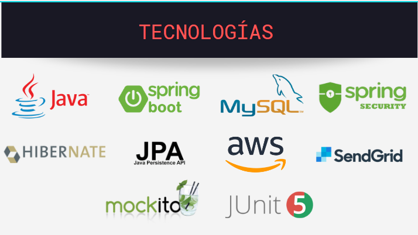

BACKEND

# Proyecto ONG Somos Más

Este proyecto es de tipo  API REST para una ONG donde se nos solicito realiza el backend de un sitio web  que sea su carta de presentación para su organización donde puedan compartir novedades con la comunidad, contar sobre el trabajo que llevan a cabo, mostrar información sobre el equipo que esta atrás de cada acción de la organización, cuyo contenido del sitio web pueda ser administrados por ellos mismo.
# Tecnologías

API REST
"/swagger-ui.html"

https://documenter.getpostman.com/view/17010342/UVJcnHjR#c82764ed-ca4f-4aa1-ae61-9e2156e3a3a4

